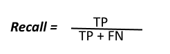
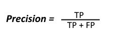

# Credit_Card_Fraud_Detection
# 1. Define the problem: 
Now a days, credit or debit card’s are the most common method of payments. Using payment cards, consumers can make purchases in-store or online or in-app and it made life easier. On the other side, fraudsters are finding different ways to steal the customer credit/debit card information to make fraudulent purchases. Card fraud is the biggest challenge for organizations particularly those in banking, finance, retail, and e-commerce. Payment card fraud loss reached to $27.85 billion in 2018 across the worldwide and are projected to $35.67 billion in five years and $40.63 in 10 years according to the The Nilson Report, the leading global card and mobile payments trade publication. However, fraud losses per $100 of total sales declined to 6.86¢ from 6.95¢ the prior year.

2019 Nelson Report:

Source: https://www.prnewswire.com/news-releases/payment-card-fraud-losses-reach-27-85-billion-300963232.html
                                         
The costs of fraudulent transactions can eat away at any business owner’s balance sheet. Additionally, it takes the good customers away from them while attracting more fraudsters.
# Inspiration: 
This problem motivated me to perform research on a credit card fraud detection Kaggle data set to identify the credit card fraud transactions using Machine learning techniques.
The data set collected from Kaggle has credit card transactions made in two days by European card holders where we have 492 frauds out of 284,807 transactions. The dataset is highly unbalanced, the positive class (frauds) account for 0.172% of all transactions.

It contains 31 features in total. Because of the confidentiality issues 28 features(V1, V2, V3, V4...V28) are transformed with PCA. The only features which have not been transformed with PCA are 'Time', 'Amount', 'Class'(Response variable- Fraud - 1, Not Fraud - 0). In this project, we build and compare several machine learning models(Logistic Regression, K-Nearest Neighbor, Decision Tree, Support Vector Classifier) to classify the payment transaction to fraud or normal transaction. The performances of algorithms are evaluated through the following performance metrices: confusion matrix, precision, recall, and Precision-Recall curve(appropriate for imbalanced datasets). 

## Confusion Matrix:
A Confusion matrix is used for evaluating the performance of a classification model. The matrix compares the actual target values with those predicted by the machine learning model. This gives us a holistic view of how well our classification model is performing and what kinds of errors it is making.

Here,
* Class 1 : Positive\n
* Class 2 : Negative
Definition of the Terms:
* Positive (P) : Observation is positive (for example: is an apple).
* Negative (N) : Observation is not positive (for example: is not an apple).
* True Positive (TP) : Observation is positive, and is predicted to be positive.
* False Negative (FN) : Observation is positive, but is predicted negative.
* True Negative (TN) : Observation is negative, and is predicted to be negative.
* False Positive (FP) : Observation is negative, but is predicted positive.
 
## Recall:
 
Recall tells us how many of the actual positive cases we were able to predict correctly with our model. High Recall indicates the class is correctly recognized (a small number of FN).

## Precision:
 
Precision tells us how many of the correctly predicted cases actually turned out to be positive. High Precision indicates an example labelled as positive is indeed positive (a small number of FP).

# Precision-Recall curve:

# 2. Data Discovery
       2.1 Data Wrangling
       2.2 Exploratory Data Analysis
       
# 2.1 Data Wrangling

## 2.1.1 Detecting the missing values

                

There is no missing data in the given data set

## 2.1.2 Checking the format of the data types

 

All columns have the correct data types and it makes sense to have data types as only int and float since the data set contains only numerical variables(V1 to V28 are transformed with PCA so they are only float type and we observed time and amount columns have numerical values of type float and our response varibale "Class" has two values Fraud - 1, Not Fraud - 0 so it is integer type). 

# 2.2 Exploratory Data Analysis

Lets understand the data distribution of non-transformed data- Time, Amount, and Class

# 2.2.1 Distribution of transaction amount

Distribution shows that most of the transaction are below 70 dollars so there might be chances fraudsters tries to mix up with this group and makes fraudlent transaction with below 70 dollars amount

 

# 2.2.2 Distribution of transaction time

Distribution of time for two days shows that most of the transactions are taken place during the daytime and peaked after business hours timing and later it's slowed down until the next day

 

# 2.2.3 Distribution of response variable

By seeing the distribution of Class(1-Fraud or 0- Not Fraud) its clear that the data is highly imbalanced.

 

# 2.2.4 Correlation between the variables: 

Using heat map, examined the correlation between the variables to make sure there is no strong collinearity between the independent variables 

 

From the heat map we have observed that all diagonal elements shown strong collinearity since it shows the collinearity between the same variables. We also noticed that there is correlation between Time and V3, Amount and V2,Amount and V5, Amount and V7, Amount and V20. Lets find out the exact correlation coefficient to make sure whether we can consider these correlations or not

 

# 3. Develop
      3.1 Develop and Test Default Models
      3.2 Hyperparameters optimization and Select Best Model
      3.3 Plot precission recall curve
# 3.1 Develop and Test Default Models

## 3.1.1 Dealing with imbalanced data set

As we observed, this data set is imbalanced so I assume undersampling will helps us to predict more accurate results. However, there might be chance to miss the important information when we do undersampling. Lets measure the accuracy by building a separate logistic regression model by training with skewed data(80% data from whole data) and another logistic regression model build with undersampled data.

Started first with undersampled data and trained the logistic regression model using undersampled training data and classified the response variable using undersampled test data

 

precision and recall, among other metrics:

 

Logistic regression model performed well on undersampled test data with recall score of 93% and precission score of 95%. Lets see how the model will work when we trained with 80% trained data taken from original data)

Trained the logistic regression model with 80% random sample data taken from the original data and used the same undersample test data to classify the response variable

 

 

Its clear that the logistic regression model showed low performance when trained with 80% data taken from whole data with true fraud detection rate(recall rate) of 58. Logistic regression Model performed well when we trained with undersampled data with high recall rate of 93%. The same will be applicable for other classification models as well when we are dealing with unbalanced data. Moving forward we will use the undersampled data to train the different classification models.

# 3.1.2 Build and test the following models using the default parameters

Trained Logistic Regression, k-nearest neighbors(KNN), Decision Tree, Support Vector Machine(SVM) default models using the undersample train data and validated the models using undersample test data

Calculated and ploted the confusion matrix for each model

 

 

Logistic regression showed best performance on test data with precission score of 95% and recall percentage of 93%. Lets try to check the accuracy of the models by using another large sample of test data.

 

 

Even on the original dataframe test data, logistic regression model showed best performance with good recall percentage of 93. However, the precision score went low for all models. Lets try to improve the accuracy of the models by tuning the parameters.

# 3.2 Hyperparameters tuning

  

  

Tuned Logistic regression performed well compared with tuned KNN, Decission Tree, and SVM models using GridSearchCV. On original dataframe test data, logistic regresion model identified the 91 fraud transactions out of 98 transactions with recall score of 93% and also it showed best performance to classify the non fraud precission by correctly identifying 55,635 transactions out of total non fraud(56,864) transactions. Logistic regression model did very well to identify the fruad transactions and in the same time model wrongly classified 1229 non fraud transactions as fraud transactions out of total non fraud(56,864) transactions and in terms of statistics, the model misclassifed only 0.02% of non fraud transactions. But in terms of business, there will be chances in production our model can classify the non fraud transactions as fraud transactions and it might end up blocking the customer's card, ulimately it takes the good customers away from the merchants. So its important to make our model to reduce the misclassifcation of non fraud transactions as much as possible since its very important for financial organization to address the risk along with customer satisfaction. 

Lets plot the precision recall curve to review both precision and recall of Logistic Regression at different thresholds and it will be useful since there is an imbalance in the observations between the two classes. Specifically, there are many examples of no event (class 0) and only a few examples of an event (class 1). 

# 3.3 Plot precission recall curve

 

Precission recall curve showed us visually that there are thresholds where logistic regression model showed decent precision and recall scores. Lets identify the best threshold for our logistic regression model. P

Printed the metrices in the follwing order threshold, f1, accuracy, recission, precision:

 

Looking at the thresholds, we can make our model stabilized if we use threshold value as 0.84(Recall - 86.73, Precision-39.35). It will be always good to have balanced model even though changing the threshold from 0.5(default) to 0.84 brings down the recall percentage from 93 to 86.73 but the precision score is jumped from 0.07 to 0.39. Lets deploy and test our logistic regression model with threshold 0.84

# 4. Deploy

Deployed and tested the logistic regression model with threshold 0.84

## 4.1.1 Calculated and ploted confusion matrix for final logistic regression model

 

## 4.1.2 Performance metrics of final Logistic Regression Model

 

# Conclusion: Hyperparameter optimization and thershold change helped us to reduce the logistic regression model misclasification of non fraud transactions (in original dataframe test data) from 2183 to 134 transactions and also precission score improved from 0.04%(default) to 0.39%. However, in order to to make our model more stabilised and to improve the precission score we have bring down our recall score from 93% to 87%. Now, logisitic regression model can classify the fraud transactions with minimum number of misclassifications of non fraud transactions.

# Next steps: 
Conduct research and identify the better techniques to improve the accuracy of model which can give even better precission and recall score to identify the fraud transactions. 

