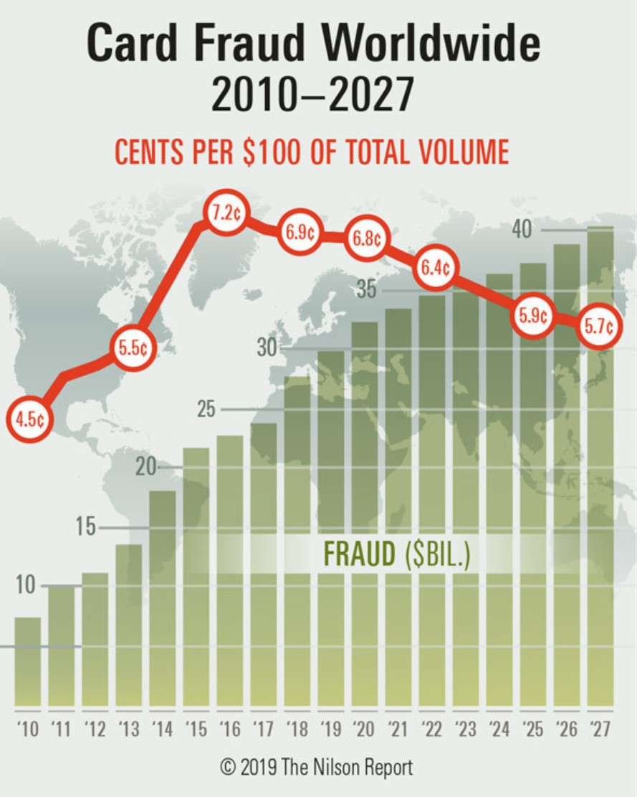
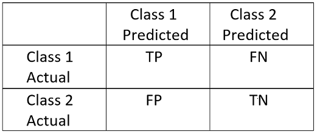
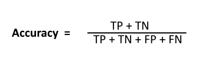

# Credit_Card_Fraud_Detection
# Define the problem: 
Now a days, credit or debit card’s are the most common method of payments. Using payment cards, consumers can make purchases in-store or online or in-app and it made life easier. On the other side, fraudsters are finding different ways to steal the customer credit/debit card information to make fraudulent purchases. Card fraud is the biggest challenge for organizations particularly those in banking, finance, retail, and e-commerce. Payment card fraud loss reached to $27.85 billion in 2018 across the worldwide and are projected to $35.67 billion in five years and $40.63 in 10 years according to the The Nilson Report, the leading global card and mobile payments trade publication. However, fraud losses per $100 of total sales declined to 6.86¢ from 6.95¢ the prior year.

Source: https://www.prnewswire.com/news-releases/payment-card-fraud-losses-reach-27-85-billion-300963232.html
                                         
The costs of fraudulent transactions can eat away at any business owner’s balance sheet. Additionally, it takes the good customers away from them while attracting more fraudsters.
# Inspiration: 
This problem motivated me to perform research on a credit card fraud detection Kaggle data set to identify the credit card fraud transactions using Machine learning techniques.
The data set collected from Kaggle has credit card transactions made in two days by European card holders where we have 492 frauds out of 284,807 transactions. The dataset is highly unbalanced, the positive class (frauds) account for 0.172% of all transactions.

It contains 31 features in total. Because of the confidentiality issues 28 features(V1, V2, V3, V4...V28) are transformed with PCA. The only features which have not been transformed with PCA are 'Time', 'Amount', 'Class'(Response variable- Fraud - 1, Not Fraud - 0). In this project, we build and compare several machine learning models(Logistic Regression, K-Nearest Neighbor, Decision Tree, Support Vector Classifier) to classify the payment transaction to fraud or normal transaction. The performances of algorithms are evaluated through the following performance metrices: confusion matrix, precision, recall, and Precision-Recall curve(appropriate for imbalanced datasets). 

# Confusion Matrix:
A Confusion matrix is used for evaluating the performance of a classification model. The matrix compares the actual target values with those predicted by the machine learning model. This gives us a holistic view of how well our classification model is performing and what kinds of errors it is making.

Here,
Class 1 : Positive\n
Class 2 : Negative
Definition of the Terms:
Positive (P) : Observation is positive (for example: is an apple).
Negative (N) : Observation is not positive (for example: is not an apple).
True Positive (TP) : Observation is positive, and is predicted to be positive.
False Negative (FN) : Observation is positive, but is predicted negative.
True Negative (TN) : Observation is negative, and is predicted to be negative.
False Positive (FP) : Observation is negative, but is predicted positive.

# Classification Rate/Accuracy:
Classification Rate or Accuracy is given by the relation:

 
# Recall:
 
Recall tells us how many of the actual positive cases we were able to predict correctly with our model. High Recall indicates the class is correctly recognized (a small number of FN).

# Precision:
 
Precision tells us how many of the correctly predicted cases actually turned out to be positive. High Precision indicates an example labelled as positive is indeed positive (a small number of FP).

# Precision-Recall curve:

# 2. Data Discovery
       2.1 Data Wrangling
       2.2 Exploratory Data Analysis
       
# 2.1 Data Wrangling

Detecting the missing values

